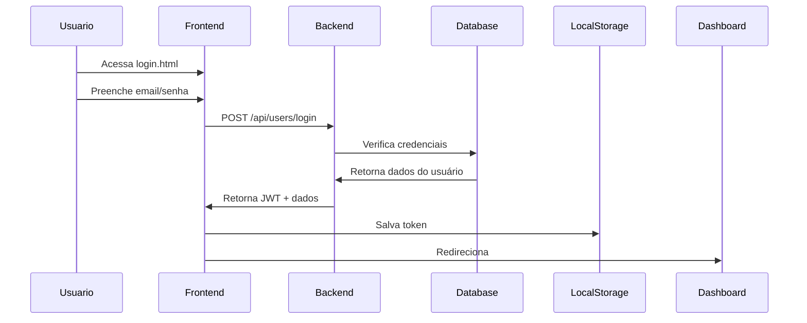
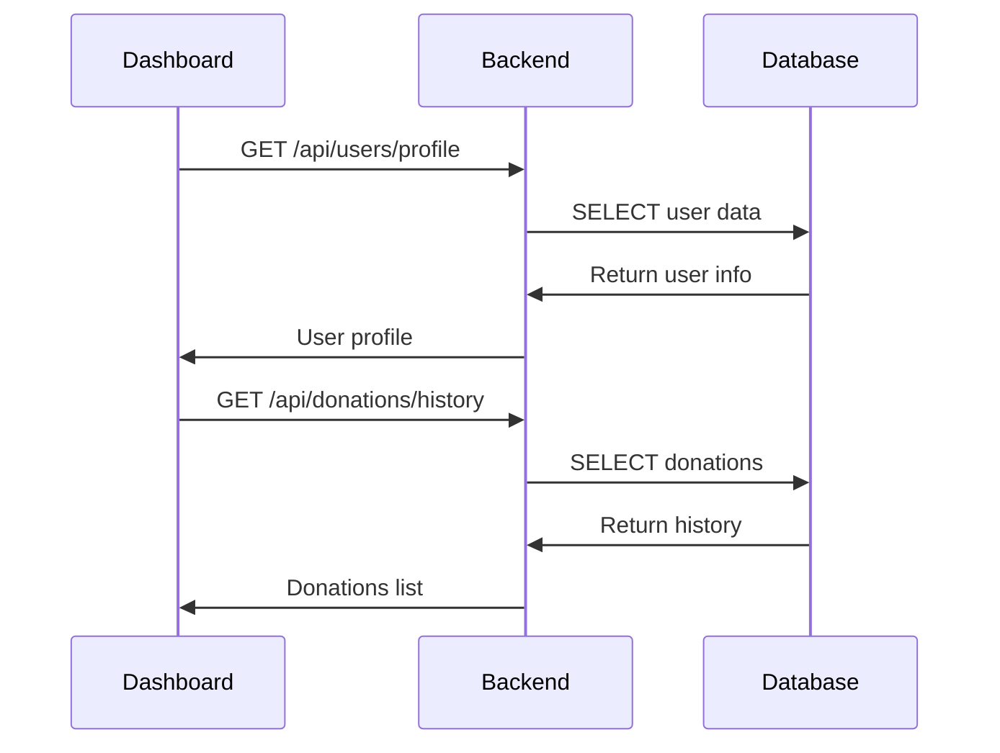
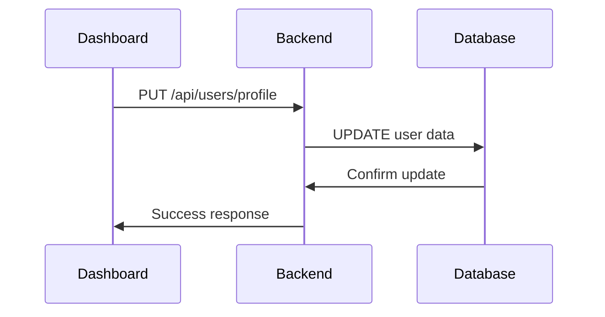

# Documentação do Fluxo de Login e Dashboard

## 🔑 Fluxo de Autenticação

### 1. Login do Usuário


### 2. Processo de Autenticação
1. Usuário acessa `login.html`
2. Preenche formulário com:
   - Email
   - Senha
3. Frontend faz requisição POST para `/api/users/login`
4. Backend:
   - Valida credenciais
   - Gera token JWT
   - Retorna token + dados do usuário
5. Frontend:
   - Salva token no localStorage
   - Redireciona para `dashboard.html`

## 📊 Dashboard

### 1. Carregamento Inicial
```javascript
// Verificação de autenticação
if (!auth.isAuthenticated()) {
    window.location.href = 'login.html';
}

// Carregamento de dados
async function loadUserData() {
    const userData = await doadores.getProfile();
    // Atualiza interface
}
```

### 2. Funcionalidades Disponíveis
- **Perfil do Usuário**
  - Visualização de dados
  - Atualização de informações
  - Tipo sanguíneo

- **Doações**
  - Histórico
  - Agendamento
  - Pontuação

- **Recompensas**
  - Catálogo
  - Resgate
  - Histórico

## 🛠 Configuração do PostgreSQL

### 1. Instalação
1. Baixe PostgreSQL: https://www.postgresql.org/download/
2. Execute o instalador
3. Anote a senha do usuário postgres

### 2. Criação do Banco
```sql
-- Conectar ao PostgreSQL
psql -U postgres

-- Criar banco de dados
CREATE DATABASE banco_sangue;

-- Conectar ao banco
\c banco_sangue

-- Executar script de schema
\i caminho/para/schema.sql
```

### 3. Estrutura do Banco

#### Tabelas Principais
1. **usuarios**
   ```sql
   CREATE TABLE usuarios (
       id SERIAL PRIMARY KEY,
       nome VARCHAR(100) NOT NULL,
       email VARCHAR(100) UNIQUE NOT NULL,
       senha VARCHAR(255) NOT NULL,
       tipo_usuario VARCHAR(20) DEFAULT 'usuario',
       created_at TIMESTAMP DEFAULT CURRENT_TIMESTAMP
   );
   ```

2. **doadores**
   ```sql
   CREATE TABLE doadores (
       id SERIAL PRIMARY KEY,
       usuario_id INTEGER REFERENCES usuarios(id),
       tipo_sanguineo VARCHAR(5) NOT NULL,
       pontos INTEGER DEFAULT 0
   );
   ```

### 4. Configuração do Backend

#### Arquivo .env
```env
PORT=5000
DB_USER=postgres
DB_HOST=localhost
DB_NAME=banco_sangue
DB_PASSWORD=sua_senha_aqui
DB_PORT=5432
JWT_SECRET=seu_segredo_jwt
```

#### Conexão com o Banco
```javascript
const { Pool } = require('pg');
const pool = new Pool({
    user: process.env.DB_USER,
    host: process.env.DB_HOST,
    database: process.env.DB_NAME,
    password: process.env.DB_PASSWORD,
    port: process.env.DB_PORT
});
```

## 🔄 Fluxo de Dados

### 1. Carregamento do Dashboard


### 2. Atualização de Dados


## 📝 Endpoints da API

### Usuários
- `POST /api/users/login`
  ```json
  {
    "email": "usuario@email.com",
    "senha": "senha123"
  }
  ```

- `GET /api/users/profile`
  - Header: `Authorization: Bearer {token}`

### Doações
- `GET /api/donations/history`
  - Header: `Authorization: Bearer {token}`

### Recompensas
- `GET /api/rewards`
  - Header: `Authorization: Bearer {token}`

- `POST /api/rewards/redeem`
  ```json
  {
    "recompensaId": 1
  }
  ```

## ⚠️ Tratamento de Erros

### 1. Frontend
```javascript
try {
    await api.request();
} catch (error) {
    showError('Mensagem amigável ao usuário');
}
```

### 2. Backend
```javascript
app.use((err, req, res, next) => {
    console.error(err.stack);
    res.status(500).json({ message: 'Erro interno do servidor' });
});
```

## 🔒 Segurança

### 1. Autenticação
- Tokens JWT
- Senhas hasheadas
- Sessões seguras

### 2. Banco de Dados
- Prepared Statements
- Validação de inputs
- Controle de acesso

## 📱 Interface do Usuário

### 1. Componentes Principais
- Header com navegação
- Seção de perfil
- Lista de doações
- Grid de recompensas

### 2. Responsividade
- Adaptação mobile
- Breakpoints definidos
- Flexbox/Grid layout

## 🔍 Monitoramento

### 1. Logs
```javascript
console.error('Erro:', error);
// Implementar sistema de logging
```

### 2. Performance
- Queries otimizadas
- Caching quando possível
- Monitoramento de tempo de resposta
